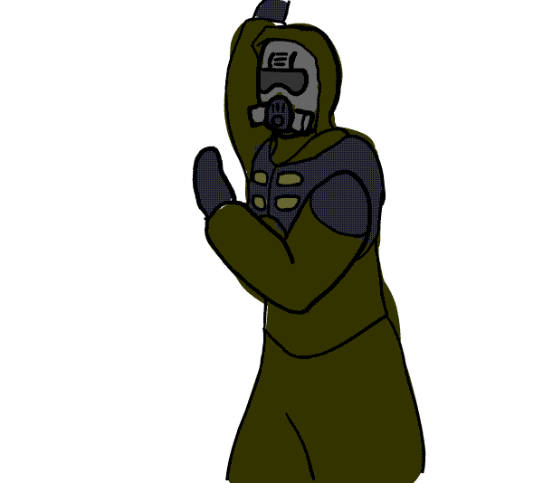

#  Welcome!

*   🌍  Karlsruhe, Germany
*   ✉️  Contact: [tosoxdev@null.com](mailto:tosoxdev@null.com)
*   🚀  Currently working on: [rpc4stalker](http://github.com/TosoxDev/rpc4stalker)
*   🧠  Learning: Java

### 📚 Languages

&nbsp;&nbsp;&nbsp;&nbsp;
 &nbsp;
 &nbsp;
 &nbsp;

### 📊 Stats

### 🏢 Orgranizations

&nbsp;&nbsp;&nbsp;&nbsp;
 &nbsp;

 &nbsp;
 &nbsp;
 &nbsp;

